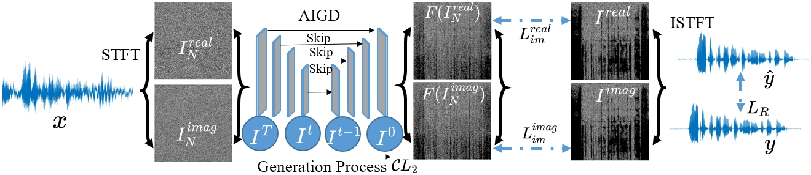
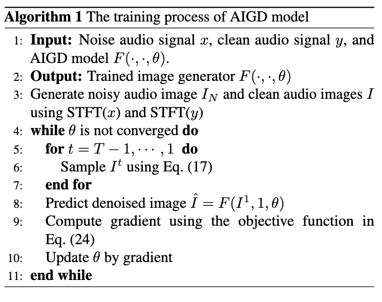
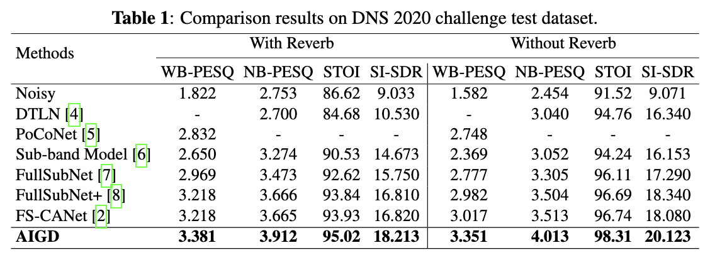
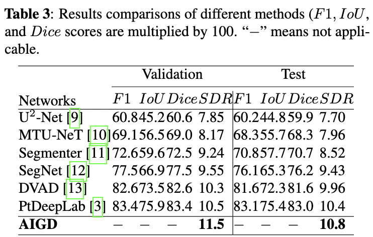
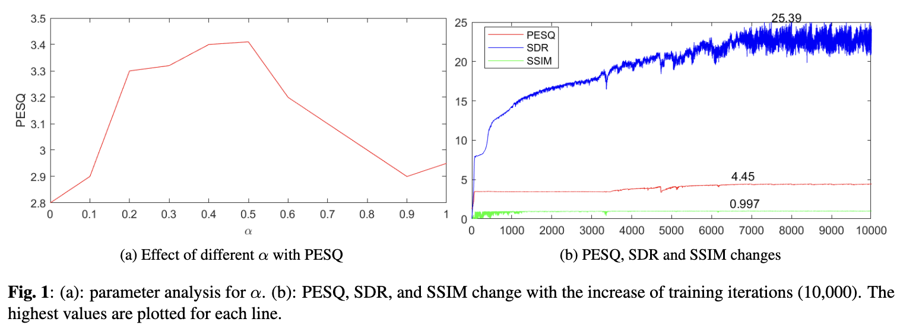

# Audio Image Generation for Denoising

## Please check more details in Supplementary Material_Audio_Image_Generation_for_Denoising.pdf

## AIGD Model Architecture

- We develop the AIGD model for audio denoising. 

    
    
AIGD model.

## Algorithm of AIGD

    
    
The Training Algorithm.

## Results of DNS challenge dataset

    
    
Results of DNS challenge dataset 

## Results of BirdSoundsDenoising dataset

    
    
 Results of BirdSoundsDenoising dataset.

## Parameter analysis

    
    

